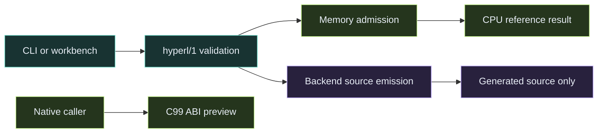
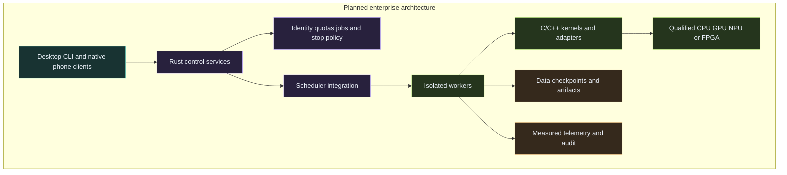
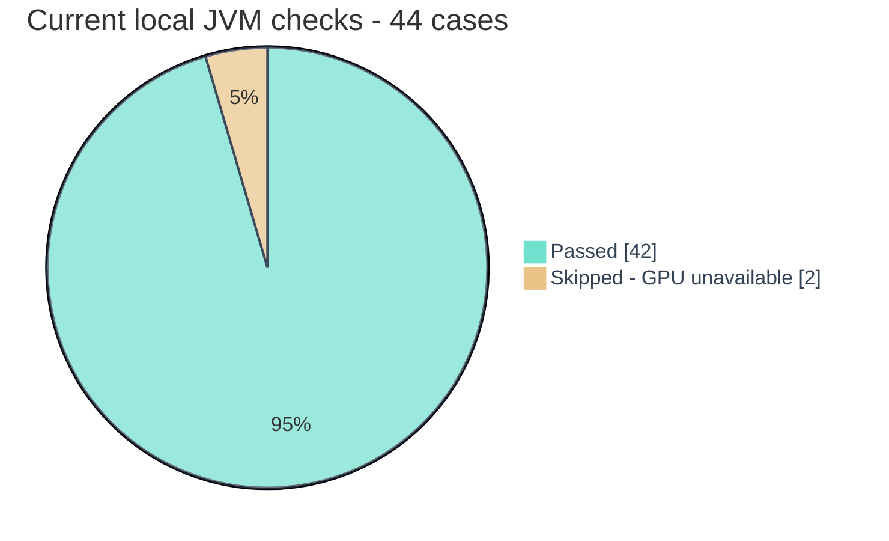

<div align="center">

# HyperL

### AI compute experiments and developer tools

**Simple authoring. Native execution. A path from one device to AI clusters.**

[](LICENSE)
[](docs/VALIDATION.md)
[](https://github.com/sabbirimon/HyperL/releases/tag/v0.1.0-alpha.5)
[](https://github.com/sabbirimon/HyperL/actions/workflows/ci.yml)

[Download](https://github.com/sabbirimon/HyperL/releases) · [Desktop installers](docs/DESKTOP_INSTALLERS.md) · [Use cases & libraries](docs/USE_CASES.md) · [Install & program](docs/USER_GUIDE.md) · [Roadmap](docs/ARCHITECTURE_AND_ROADMAP.md) · [Enterprise plan](docs/ENTERPRISE_AND_CLUSTER_PLAN.md) · [Issues](https://github.com/sabbirimon/HyperL/issues)

</div>

**Development licence:** newly covered material uses the [HyperL Community and
Enterprise License 1.0](LICENSE). Personal, developer and research use is free;
small-business production is free. A group with **US$10 million annual revenue/
budget or 100 employees** gets one six-calendar-month enterprise production trial,
then needs a paid written agreement or must stop that covered production use.
Contact [sabbirimon@gmail.com](mailto:sabbirimon@gmail.com).
[Examples and terms](docs/LICENSING.md) · [Contribution rights](CONTRIBUTING.md).

This development licence is source available. **Published releases through alpha.5
and earlier Apache-covered code keep Apache 2.0 rights**, including enterprise
use and forks. A notice change cannot revoke those rights.
[Scope/history](docs/LICENSE_HISTORY.md). Alpha.6 is unreleased development source;
the alpha.5 badge above points to the existing Apache release.

HyperL explores a common way to describe, validate and eventually execute AI workloads
across CPUs, GPUs and other accelerators. Its goal is to give developers approachable
authoring tools and explicit memory, device and numerical contracts, while letting
qualified native backends use each platform's capabilities.

**Today, HyperL is an experimental standalone CLI and desktop workbench**, with a
bounded f32 CPU reference, portable C ABI preview, backend source emitters, optional
OpenCL and macOS Metal host bridges, memory-aware CPU admission and encrypted local dataset streaming.
Twelve ready-made recipes are available through Kotlin/JSON, the CLI and Python/C ABI preview.
Native desktop installer previews bundle Java; the separate Meshlit port adds a local
recipe workbench with per-function and emergency stop controls.
The broader native compiler, Python-like text language, full SDK, mobile packages and
enterprise cluster services are planned. This alpha is not a CUDA-compatible replacement
or a production distributed AI runtime. [Current evidence and limits](docs/VALIDATION.md).

Created by **Sabbir Hassan Imon (IMON)** with Codex assistance. HyperL is independent;
[Meshlit](https://github.com/sabbirimon/meshlit-v2) is a separate potential client.

## Why build HyperL?

AI developers face different runtime APIs, memory domains and deployment environments.
HyperL's direction is to put a stable program/adapter contract between developer intent
and platform execution, so portability does not require hiding unsupported operations
or pretending every accelerator behaves the same.

| Goal | Benefit to developers and operators | Delivery boundary |
|---|---|---|
| Easy as Python to start | Small examples, useful errors, sensible defaults and later Python-like syntax/API | Local editor/diagnostics and small Python preview exist; full authoring/SDK later |
| Native compute where it matters | Explicit buffers, fused/compiled kernels and target-specific adapters | C99 preview exists; optimized C/C++ engine and speedups require benchmarks |
| One program contract across devices | Reuse validation and precision rules instead of unrelated per-vendor semantics | `hyperl/1` f32 reference/source format exists; tensor/import/runtime support expands later |
| Memory-aware large-data work | Predict cost, reject oversized work, stream encrypted data and plan future spill | CPU estimate/admission and local chunk IO exist; HBM/VRAM accounting and automatic spill are planned |
| Single-device through cluster deployment | Keep offline local use useful while adding optional remote capacity | Desktop works today; phone and enterprise packages have separate qualification gates |
| Human control and enterprise operations | Tenant quotas, audit, scoped agents and acknowledged emergency stops | Enterprise services/control protocol are planned, not deployed by this release |
| Available source and reproducible evidence | Study code, contribute adapters, reproduce correctness and measure real performance | Community/enterprise terms for new rights; prior Apache and dependency grants preserved |

Useful AI/security/vision goals include preprocessing kernels, inference pipelines,
large-dataset preparation, evaluation and governed fleet operations. Full models,
training, advanced crypto providers and hardware profiling need their own backends;
the current f32 kernels are not an encryption primitive or complete model engine.

## Developer workbench


Choose **Graphite**, **Aurora** or **Paper** from the thin header strip. The workbench
uses **Inter** for the interface and **JetBrains Mono** for code, compact spacing and
a wider editor split. **Focus** gives the editor the full workspace width; toggle it
again to restore output. Optional glass highlights and theme selection persist locally.
Switching themes preserves the program, inputs and results. Paper uses readable light
editor surfaces; the dark themes use restrained teal/violet grading.
The screenshot renders the actual Swing panel headlessly after a real CPU run;
it does not establish a native GUI session or GPU execution.

- Editable program/input JSON: highlighting, line numbers, folding, undo, formatting
  and literal search; two working examples and explicit workspace open/save.
- Validate and Analyze: field-level errors, context suggestions, shapes/memory/backend
  limits and actual supplied-input CPU checks. **Review fix** previews supported edits
  and rejects stale text; sample success does not prove all programs bug-free.
- Separate **Execution**, **Source emission** and **GPU setup** tabs, memory-budget
  controls, real task status, local Stop and source/result export.
- CLI parity, local JSON schema and an optional VS Code process task. Full VS Code/
  JetBrains plugins, semantic language server, debugger and profiler remain later.

[Workbench design](docs/UI_DESIGN_PLAN.md) · [Developer tools](docs/DEVELOPER_TOOLS_PLAN.md) · [Diagnostics](docs/CODE_DIAGNOSTICS.md) · [Font provenance](docs/FONT_PROVENANCE.md)

## HyperL software platform

HyperL has nine architecture layers, from one local workstation to planned AI
clusters. They group code and roadmap interfaces; only the documented local tools
are delivered today. Read the [complete stack and deployment profiles](docs/SOFTWARE_STACK.md).

| Layer | Current delivery | Next milestone |
|---|---|---|
| Core | Bounded f32 CPU execution and C ABI preview | Optimized C/C++ kernels and tensor primitives |
| Developer Tools | CLI, workbench, validation and reviewed fixes | SDK, LSP, IDE plugins, debugger/profiler |
| SDK and Libraries | Python/native preview, NumPy/CPU Torch copies, recipes | Model/framework import and explicit zero-copy ownership |
| Compute Adapters | Six source emitters; OpenCL/Metal host previews | Vendor-by-vendor hardware qualification |
| Memory and Data | CPU admission and encrypted local streaming | HBM/VRAM/NUMA/CXL accounting and encrypted spill |
| AI Services | Small preprocessing recipes | Full model inference, training, vision and serving |
| Control Services | Configuration and read-only node observations | Rust fleet services, quotas, durable jobs and acknowledged stop |
| Fabric | IPv6/IPv4/DNS endpoint configuration and HTTPS probe | Collective communication and qualified fabric transports |
| Security and Operations | Local authenticated encryption and cancellation | Enterprise identity, RBAC, audit and measured telemetry |

**Support counts:** two CPU implementations, six source emitters, two desktop GPU
host previews and one Android Vulkan qualification runner. Exact workload evidence
exists for Radeon Pro 560X and Adreno 506; **zero NVIDIA architecture families are hardware-qualified**.
See the [NVIDIA architecture/software matrix](docs/NVIDIA_COMPATIBILITY.md),
[AMD ROCm/AI matrix](docs/AMD_COMPATIBILITY.md), [AI Services plan](docs/AI_SERVICES_PLAN.md), and
[AMD Mac / Metal build and test guide](docs/MACOS_METAL.md).

## What runs now?

| Area | Current alpha behavior |
|---|---|
| CPU reference | Real finite f32 `add`, `multiply`, `relu`, ordered `sum`; bounded DAG/vectors, validation and cancellation |
| Native embedding | Original C99 arithmetic library and C ABI preview; static/shared build, explicit Python bridge; full SDK later |
| Python libraries | Native CPU recipes, NumPy/CPU Torch copying bridges and optional verified PyTorch elementwise path; CUDA requires separate hardware validation |
| Memory planning | Observed JVM heap/environment plus full-array estimate/admission; not VRAM reservation or a hard RSS limit |
| Backend source | C99/CPU, CUDA, HIP, OpenCL C, Metal and Vulkan GLSL emission; emission alone does not compile/run those backends |
| Optional GPU | Explicit OpenCL/macOS Metal hosts; four bounded Metal cases passed on AMD Radeon Pro 560X, with CPU verification and expected overflow rejection. Other GPUs and full models need separate qualification |
| Android GPU experiment | Samsung Galaxy A20s / Adreno 506 executes generated Vulkan kernels: 11 CPU-verified outputs and two expected overflow rejections. Native test runner; Meshlit GPU wiring and mobile installers remain separate. [Build and evidence](docs/ANDROID_VULKAN.md) |
| Large local files | Bounded 4 MiB chunks, AES-256-GCM, authenticated manifest/integrity, quota, cancellation and no-overwrite publication |
| Node probe | Explicit authenticated read-only metadata request to a configured HTTPS endpoint, or numeric HTTP loopback |
| Cluster profile | Validates IPv6/IPv4/DNS HTTPS configuration and limits; does not enroll, schedule or dispatch nodes |
| Telecom research | Disabled/uncertified research profiles and a full-stack research plan; no RF or carrier stack activation |



The optional OpenCL/Metal paths need a reviewed local executable, installed runtime/driver
and a supported GPU. It never silently substitutes CPU hardware. Java memory policy
and the C ABI have different ownership scopes; source generation is a separate path.
See [platform support and qualification](docs/PLATFORMS.md).

## Quick start

Download a versioned ZIP/TAR and matching checksum from [Releases](https://github.com/sabbirimon/HyperL/releases).
Verify the digest, install a maintained **Java 17+** runtime, then extract the archive.
The same distribution includes CLI, GUI, examples, documentation and native C source.
No account, Android Studio or cloud provider is required.

Linux/macOS, from the extracted directory:

```sh
bin/hyperl capabilities
bin/hyperl run examples/elementwise.json examples/inputs.json
bin/hyperl diagnose examples/elementwise.json examples/inputs.json
bin/hyperl memory-plan examples/elementwise.json examples/inputs.json
bin/hyperl gui
```

Windows PowerShell uses the corresponding launcher:

```powershell
.\bin\hyperl.bat run examples\elementwise.json examples\inputs.json
.\bin\hyperl.bat gui
```

The example returns **`[0, 6, 12]`**: multiply vectors, then apply ReLU. Change inputs
or load the reduction example in the workbench. Programs are bounded declarative JSON;
opening a workspace does not execute shell hooks. A graphical desktop is required for
`gui`; servers can use CLI/native libraries without starting a UI.

Optional Python installer verifies the archive and creates a **new user-selected
prefix**, with no root/admin or global PATH change. Uninstall that prefix after closing
programs; keep keys, datasets and projects separately. [Full install/programming guide](docs/USER_GUIDE.md)
includes checksum commands, native embedding, GPU setup and troubleshooting.

## Performance architecture

Owner-approved direction: **C/C++ for kernels and accelerator adapters; Rust for
cluster services**, with a stable C ABI. Python-style ease belongs in the authoring
layer; the execution engine is native. Today's desktop tools remain Kotlin/JVM while
the native compiler/CLI and later full SDK develop.

Keep parsing, UI, scheduling and telemetry outside timed kernels. Qualify native
SIMD/fusion, buffers and accelerator transfers before advertising speedups. A native
UI is an evaluation milestone: compare startup, memory, package size and responsiveness
on Windows/Linux/macOS instead of assuming a new UI language speeds up inference.
[Native architecture decision and measurement gates](docs/NATIVE_PERFORMANCE_ARCHITECTURE.md).

## Library compatibility and easy migration

Use a standard Python API first; keep existing NumPy/PyTorch workflows and migrate
supported preprocessing regions gradually. The alpha.4 preview includes an explicit
native-library loader, versioned bounded programs and reusable `weighted_relu`,
`residual_relu` and `positive_sum` helpers. NumPy/CPU Torch arrays can be copied into
HyperL and exported back. An optional installed-PyTorch path runs selected elementwise
operations and checks them against the native C reference before returning a tensor.

```python
from hyperl import NativeCpu, f32, weighted_relu

cpu = NativeCpu("/absolute/path/to/your/libhyperl_cpu_runtime.so")
y = weighted_relu(cpu, f32([-1, 2, 3]), f32([2, 3, 4]))
print(list(y))  # [0.0, 6.0, 12.0]
```

Build/install the local preview separately; the path is a placeholder. This is a
small interoperability foundation, not the full SDK or universal model importer.
CUDA execution needs real installed framework/driver/hardware; mandatory verification
introduces copies/synchronization, and no speedup is claimed. Autograd, reductions
in the Torch path, tensor graph/model import and arbitrary CUDA libraries are unsupported.
[Build, use, compatibility matrix and long-term migration plan](docs/LIBRARY_INTEROPERABILITY.md).

First-class roadmap candidates include **Intel oneAPI/oneDNN/OpenVINO**, **AMD
ROCm/HIP/MIGraphX**, **NVIDIA CUDA libraries**, **Huawei CANN/MindSpore**, **Baidu
PaddlePaddle**, **Alibaba MNN**, **Tencent ncnn/TNN**, Apple native APIs and Microsoft
ONNX Runtime/DirectML. Each needs version/operator/layout/precision/license and actual
hardware qualification. Chinese model families are separate from framework support.

## One phone, workstation or enterprise cluster

The design keeps a small local mode and adds optional services as the deployment grows.
**Phone support is planned**, through native Android/iOS packages and qualified local
CPU/GPU/NPU paths, with optional authenticated remote access. Desktop Java GUI archives
are not Android/iOS installers. Non-root/sandboxed use is the default. The owner resumed
single-phone GPU tests: [Adreno 506 Vulkan checks pass](docs/ANDROID_VULKAN.md).
Meshlit app GPU integration and two-phone cluster acceptance remain pending.
[Mobile/edge plan](docs/MOBILE_AND_EDGE_PLAN.md).

The [enterprise/datacenter plan](docs/ENTERPRISE_AND_CLUSTER_PLAN.md) defines useful
services: identity/mTLS, tenant isolation, quotas, durable jobs/leases, scheduler
adapters, artifact/model registry, data/checkpoints, telemetry, human/agent policies,
acknowledged global Stop, upgrades/rollback and disaster recovery. These are roadmap
services; this release starts no enterprise control-plane listener.



Reuse proven systems where suitable: evaluate Kubernetes/Slurm orchestration, Ray for
selected AI workflows and OpenTelemetry for telemetry. Pin/version/license review
and actual integration tests precede adoption; none is bundled as a working cluster.
Current configuration limits—up to **1,000,000 inventory entries** and **256 active
workers**—are validation bounds, not demonstrated operating capacity. Begin with an
independent 3–5-host pilot before expanding. No million-node or low-latency fabric
performance is claimed. [Detailed rollout gates](docs/ENTERPRISE_AND_CLUSTER_PLAN.md#7-size-limits-and-measured-rollout-gates).

## Evidence, not assumed performance

Local post-alpha.4 source checks: **42 JVM tests pass, two unavailable-GPU tests skip, zero failures**;
native CTest **two passes (CPU contract and Metal discovery)** and Python scripts **fourteen passes**. GUI checks execute the real
CPU/source/analysis actions and verify the bundled font families. Actual previews are
checked at 1280×820 and 1000×700. [Validation record](docs/VALIDATION.md).



This chart counts checks; it does not measure speed, reliability of a production
service or hardware capacity. [CI](https://github.com/sabbirimon/HyperL/actions/workflows/ci.yml)
runs JVM/C/installer checks on Windows, Linux and macOS; consult the run for the exact
commit. Separately, the owner's Terminal completed **four Metal GPU cases on AMD
Radeon Pro 560X** and an expected overflow rejection. See the
[hardware case and timing record](docs/A1990_METAL_VALIDATION.md). These working-source
results include the JSON fix after the published alpha.4 archives. Native GUI sessions,
Android Adreno 506 passed the bounded standalone Vulkan cases over USB and TLS
wireless ADB. Mobile app/JNI integration, other ARM/RISC-V targets, other accelerators
and live multi-host/provider paths need separate evidence.

## Roadmap


Future work includes HBM/GDDR/unified/NUMA/CXL observation, explicit encrypted SSD/NVMe
spill, supported tensor/model operators, mobile packaging, IPv6 distribution, qualified
fabric transports and full telecom-stack research. Vendor/API inspiration is not a
licensing or certification grant. Publish an LTS/support promise only after an actual
maintenance policy, qualified targets and maintainers exist.

| Documentation | Purpose |
|---|---|
| [Software stack](docs/SOFTWARE_STACK.md) | Platform layers, deployment profiles, support counts and delivery boundaries |
| [NVIDIA compatibility](docs/NVIDIA_COMPATIBILITY.md) | Eight tracked architecture families and software integration gates |
| [AMD compatibility](docs/AMD_COMPATIBILITY.md) | ROCm/HIP, frameworks, serving, EPYC, Ryzen NPU and FPGA tracks |
| [AI Services plan](docs/AI_SERVICES_PLAN.md) | Proposed model/runtime/serving contracts and integration gates |
| [Mac Metal](docs/MACOS_METAL.md) | Intel/AMD and Apple silicon host preview; exact-device Terminal qualification |
| [Install, use and program](docs/USER_GUIDE.md) | CLI/GUI, examples, C ABI, installation and troubleshooting |
| [Library interoperability](docs/LIBRARY_INTEROPERABILITY.md) | Native Python preview, recipes, tensor copying and framework/provider migration |
| [Developer experience](docs/DEVELOPER_EXPERIENCE_PLAN.md) | Python-style language/API goals, onboarding and SDK ergonomics |
| [Developer tools](docs/DEVELOPER_TOOLS_PLAN.md) | Current editing/diagnostics versus later IDE/debugger/profiler |
| [Memory contracts](docs/MEMORY.md) | What CPU admission observes and what remains unknown |
| [Native architecture](docs/NATIVE_PERFORMANCE_ARCHITECTURE.md) | C/C++ and Rust roles, ABI and performance gates |
| [Enterprise services](docs/ENTERPRISE_AND_CLUSTER_PLAN.md) | Deployment profiles, services, isolation and rollout |
| [Phone/edge plan](docs/MOBILE_AND_EDGE_PLAN.md) | Local mobile mode, lifecycle and optional remote use |
| [Platforms](docs/PLATFORMS.md) | Implemented, source-only and unqualified targets |
| [Architecture/roadmap](docs/ARCHITECTURE_AND_ROADMAP.md) | Ordered runtime/compiler/SDK milestones |
| [Telecom research](docs/TELECOM.md) | LTE/5G/future-6G research; execution disabled/uncertified |

## Build and contribute

```sh
./gradlew --no-daemon test installDist distZip distTar
cmake -S . -B build/native -DCMAKE_BUILD_TYPE=Release
cmake --build build/native --config Release
ctest --test-dir build/native -C Release --output-on-failure
python3 -m unittest discover -s scripts -p 'test_*.py' -v
```

Use `gradlew.bat` on Windows. The desktop build needs a maintained JDK 17+; native
C needs CMake 3.20+ and a C99 compiler. Optional OpenCL needs separately installed
headers/runtime/driver. Full SDK and bindings are later milestones; the C ABI is a
preview foundation. [Report issues](https://github.com/sabbirimon/HyperL/issues) with
minimal programs and actual OS/compiler/driver evidence; keep credentials and private
inputs out of reports. Contributions should preserve bounds and numerical contracts,
name untested targets and retain upstream provenance/license notices.

Newly covered HyperL rights follow [LICENSE](LICENSE), with earlier Apache grants
preserved in [licence history](docs/LICENSE_HISTORY.md). [NOTICE](NOTICE) records original Meshlit
foundation provenance and pinned dependencies. Fonts retain OFL-1.1; FlatLaf retains
Apache-2.0 and RSyntaxTextArea BSD-3-Clause. Proprietary vendor SDKs/drivers are separately
installed/licensed; no NVIDIA artwork or Odysseus AGPL implementation is copied.
