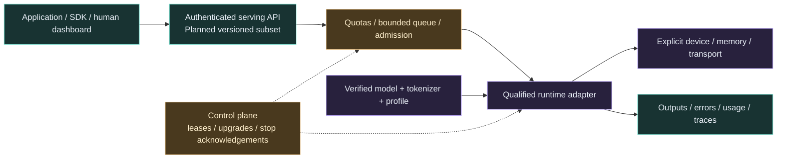

# HyperL AI Services — model serving and deployment plan

Status: **planned**, as of 2026-10-08. This responds to the owner's NVIDIA NIM/AMD
serving references. The current HyperL release executes small f32 preprocessing
programs; it does not load an LLM, start an inference server or package model weights.

## Proposed service architecture

Use a thin, versioned HyperL service contract over proven model runtimes. C/C++
handles qualified compute adapters; Rust is the intended control/service language;
Python is the first approachable developer/embedding interface. Keep model engines
separate from the bounded `hyperl/1` kernel IR instead of labeling it a model runtime.

Every node above is a proposal, not a shipped listener or operator.

## Useful services and contracts

| Service | Developer/operator value | Required acceptance |
| --- | --- | --- |
| Model/artifact registry | Reproducible models and profiles | Explicit origin/license/digest, tokenizer and engine versions; size/cache quotas; no automatic unreviewed downloads |
| Runtime adapters | Reuse existing optimized inference | Pin model/operator/dtype/OS/device/provider tuple; expose actual placement and unsupported operations |
| Serving API | Standard clients and gradual migration | Document an OpenAI-style subset plus typed inference APIs; streaming/errors/usage/cancellation tests; no universal API parity claim |
| Batching and admission | Bounded concurrent workloads | Measured queue/memory/KV-cache budgets, overload rejection, fairness and latency under real load |
| Profile selection | Match model shape/precision to hardware | Observed capability and qualified profiles; reject missing profile instead of changing requested precision/device silently |
| Evaluation and vision | Repeatable useful AI workflows | Model-specific reference datasets, preprocessing/postprocessing, privacy and quality metrics |
| Adapter customization | Selected LoRA/workflow changes | Engine/model/version compatibility, bounded memory, atomic activation and rollback; never promise arbitrary adapter portability |
| Fleet deployment | Workstation to datacenter pilot | Durable jobs/leases, isolation, checkpoints, authenticated enrollment and rollback |
| Human/agent governance | Clear operator control | Separate credentials/scopes, configured policy, audit, stop acknowledgements and unreachable-device reporting |
| Observability | Diagnose real bottlenecks | End-to-end and transfer/queue/compile/kernel metrics; no fabricated GPU utilization or speedup |

## Reuse candidates, researched from primary documentation

- [vLLM online serving](https://docs.vllm.ai/en/latest/serving/online_serving/):
  candidate for a documented compatible API subset and LLM inference. Pin the
  released server and supported hardware build before implementing its adapter.
- [ONNX Runtime execution providers](https://onnxruntime.ai/docs/execution-providers/):
  candidate for selected model graphs on CPU and qualified vendor providers.
  Report graph partitions and CPU placement explicitly; a provider list alone
  does not guarantee complete GPU execution. AMD's older ROCm EP is marked
  deprecated in the current overview; investigate its supported MIGraphX path
  rather than promising a generic ROCm EP forever.
- [Triton model repositories](https://docs.nvidia.com/deeplearning/triton-inference-server/user-guide/docs/user_guide/model_repository.html):
  candidate for versioned model/backend deployment. Use a specifically supported
  NVIDIA or [AMD ROCm build](https://rocm.docs.amd.com/projects/triton-inference-server/en/latest/);
  its API, backend and license are separate from the Triton kernel language.
- Existing Apple/Intel/AMD/Huawei/Chinese-framework providers: adapter candidates
  from the [library interoperability plan](LIBRARY_INTEROPERABILITY.md), with their
  own redistribution terms, precision contracts and real device qualification.

No upstream model/runtime code is copied, container is launched, dependency is
installed or model is downloaded by this document. The owner prefers open-source
or free research access first; verify each chosen component and model independently.

## Integration with agents and enterprise infrastructure

HyperL serving is a compute/service boundary. Meshlit or a reviewed external
MCP/A2A/LLM gateway can route to explicitly configured endpoints later. Tool execution,
cyber labs and radio operations retain their own sandbox/authorization policies;
model serving does not unlock device privileges or a security lab.

Reuse reviewed Kubernetes/Slurm/Ray orchestration where appropriate. A standalone
local service should work before a cluster operator is added. Keep raw prompts,
keys and model data out of default telemetry. Emergency stop must distinguish
requested, acknowledged, completed and unreachable work, and never equate host
termination with confirmed physical accelerator cancellation.

## Ordered delivery gates

1. One real small CPU model, explicit local runtime and reproducible inference.
2. One actual qualified GPU model, correct output, placement and memory evidence.
3. Authenticated local serving with bounded concurrency/streaming/error/cancel tests.
4. Registry/profiles and a useful Python/CLI sample, with full installation notes.
5. Separate NVIDIA and AMD service adapters; then selected Intel/Apple/Ascend paths.
6. Controlled 3–5-host pilot with durable leases, tenant isolation and stop recovery.
7. Measured 16/64/256-worker trials; publish capacity and supported profiles only
   after successful load/failure/security acceptance. Mobile has separate packages.

This roadmap complements [enterprise services](ENTERPRISE_AND_CLUSTER_PLAN.md)
and the [software stack](SOFTWARE_STACK.md); it is not a shipped NIM-equivalent suite.
