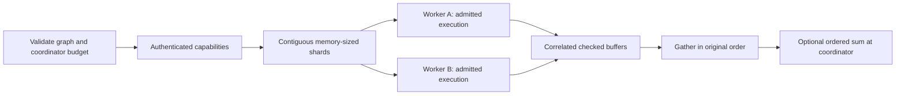

# Distributed execution — alpha.6 development

HyperL has an explicit split/map/gather executor for bounded `hyperl/1`
elementwise graphs. It sends real shards to independently started workers, runs
admitted requests concurrently, checks every returned result and gathers by the
original range. This is separate from the earlier `cluster-plan` inventory
validator. It is experimental, not a production fleet scheduler.

Adapters: **CPU_REFERENCE**, **OPENCL_SPIRV** and **METAL**. GPU workers require an
owner-installed bridge and selected device, and reuse the existing CPU-checked
execution paths. Unavailable backends are never substituted. CUDA/HIP/SYCL/NPU/
FPGA and Android Vulkan cluster workers need real adapters and device tests.

## Execution and message primitives



`ShardRequest`, `ShardResponse` and `ShardPlacement` are versioned primitives.
`hyperl-shard/1` frames contain bounded JSON metadata and network-order IEEE f32
buffers. A request carries a fresh UUID, worker-instance identity, range, timeout
and SHA-256 digest. Results must match its identity, range, digest, backend and
length. Values must be finite. CPU verification compares exact f32 bits; checked
GPU results use `1e-6 * max(1, abs(expected))`. Verification, serialization,
bridge compilation/IO and transfers are included in reported total duration.

Workers support `add`, `multiply` and `relu`, with equal-length inputs. A single
terminal `sum` after elementwise work gathers the complete vector and performs
the original **ordered f32 sum** at the coordinator, using exact CPU workers only.
Approximate GPU shards cannot participate in this reduction contract. Partial sums would change
rounding/overflow behavior. Internal reductions, broadcasting, tensors, matmul,
attention, model layers and all-reduce are not delivered. Meshlit's separate
llama.cpp model/RPC pipeline is not HyperL's vector runtime.

The coordinator owns its input snapshot/output. Each worker owns temporary
buffers under application credit leases. There is no cross-device pointer,
shared address space, remote malloc or implicit aliasing. Native buffer handles,
tensor partitions, collectives and layer placement need explicit lifetimes,
numerical semantics and independent failure tests.

## Separate memory and storage domains

Workers report configured admission budgets and observed heap headroom. Heap and
Linux NUMA observations are subsets of system RAM, not additional physical RAM.
A selected OpenCL probe reports global memory, maximum allocation and unified
memory where available. A selected Metal probe reports shared-memory identity,
maximum buffer length and recommended working set; **recommendation is not
physical capacity or free VRAM**. Missing provider values/technology stay null.

An owner-selected storage directory reports filesystem total/usable bytes.
Storage is never added to RAM or admitted as kernel memory. Filesystem type
does not identify SSD/NVMe technology. Multiple worker processes on one host
share physical resources; their capacity reports must not be summed as new RAM.

Automatic sizing uses per-worker credits, graph retention, maximum buffer/range
and coordinator staging/verification budget. `shardElements` supplies a manual
upper bound. One shard is outstanding per selected worker, with a global
`maxParallelism` limit. Admission is rechecked on every worker request. Credits
release in cleanup. Estimates cover wire buffers, copies, intermediates and
verification; they are not hard RSS limits or OS/VRAM reservations. Allocation
or device failure aborts the job.

Small shards can process more total intermediate data without lifting per-shard
retention limits. The authenticated HLM2 local dataset store remains separate.
No automatic SSD/NVMe spill, remote paging, distributed volume, KV-cache offload
or storage-to-VRAM promotion exists. Such policies need explicit quotas,
authenticated recovery and measured transfer cost.

## Start workers explicitly

Build development source with `./gradlew installDist`; published alpha.5
installers do not contain this addition. Use `bin/hyperl` or `bin/hyperl.bat`.
Create new absolute token paths in a private existing directory outside source:

```sh
bin/hyperl worker-token /absolute/private/worker-a.token
bin/hyperl worker-token /absolute/private/worker-b.token
```

Copy `examples/worker-loopback.json` to private configuration files. Replace
token paths; choose `id`/`port` as `a`/`8091` and `b`/`8092`. Each is a
separate foreground process; Ctrl-C closes the listener and requests job cancellation:

```sh
bin/hyperl worker /absolute/private/worker-a.json
bin/hyperl worker /absolute/private/worker-b.json
```

Edit a private copy of `examples/distributed-loopback.json` with those token
paths. Then explicitly observe capabilities or run a job:

```sh
bin/hyperl distributed-plan /absolute/private/cluster.json examples/elementwise.json examples/inputs.json
bin/hyperl distributed-run /absolute/private/cluster.json examples/elementwise.json examples/inputs.json
```

Plan connects to approved workers but executes no kernels. Run returns one
complete JSON result after all shards succeed. Reports contain actual worker
identities/backends, placements/domains, payload bytes, worker compute time,
round-trip and total time. Bytes exclude HTTP/TLS overhead. No bandwidth, p95,
energy, speedup or low-latency fabric claim follows from one run.

For a reviewed GPU worker, select `METAL`, an absolute `bridgeFile` and exact
`device` name, or `OPENCL_SPIRV` with its numeric device index as a string.
GPU workers allow one active job. Device/executable selection is owner
configuration, never part of incoming compute requests.

## Network and failure boundaries

HTTP is numeric `127.0.0.1`/`::1` only. Other bindings require a PKCS12
`tlsKeystoreFile` and separate private `tlsPasswordFile`. Clients use trusted
HTTPS with ordinary certificate/hostname verification. Configure a maintained
JDK trust store for your private CA; there is no trust-all switch. Keep one
random token per worker and private POSIX permissions/Windows ACLs.

Only listed origins receive data: no redirects, retries, discovery, public
relays, CORS API, shell hooks or model instructions. A token authorizes a pure
compute API; tenant isolation, identity, rotation, mTLS and durable audit remain
separate. Owner-provisioned reachability/firewalls are needed for remote use.
This service does not solve carrier NAT or transport native model layers over
Meshlit's P2P chat.

Bodies, metadata, queues, jobs, replay records and responses are bounded.
Worker admission waits at most 100 ms for the prior handler's cleanup, then
rejects a busy worker without executing or automatically retrying the request.
Deadlines reject slow operations. On failure, sibling requests are cancelled
and an authenticated cancellation request is attempted. HTTP `202` means
**cancellation requested**, not terminated. Lost connectivity or a killed GPU
host can leave completion uncertain. No automatic replay or partial success
result is returned. Existing GPU cleanup uncertainty still blocks later work.

Safety ceilings: 16 configured workers, 256 shards, 8 active CPU jobs per worker,
one GPU job, 8 MiB frames, 96 KiB metadata, 30-second shard deadlines and
five-minute job deadlines. These are not demonstrated deployment capacity.
Independent hosts, large load and mixed accelerators need separate tests.

New orchestration uses the Community/Enterprise licence; previous Apache
foundations and upstream grants remain. Interoperability does not copy newly
restricted code into Meshlit's Apache port. [Scope](LICENSE_HISTORY.md).

Transport reuses [JDK HTTP/TLS](https://docs.oracle.com/en/java/javase/21/docs/api/jdk.httpserver/com/sun/net/httpserver/package-summary.html)
and [cancellable HTTP exchanges](https://docs.oracle.com/en/java/javase/21/docs/api/java.net.http/java/net/http/HttpClient.html).
Memory metadata follows [OpenCL device observations](https://registry.khronos.org/OpenCL/specs/unified/refpages/man/html/clGetDeviceInfo.html)
and [Metal working-set recommendations](https://developer.apple.com/documentation/metal/mtldevice/recommendedmaxworkingsetsize).
See [validation](VALIDATION.md) for actual qualification.
