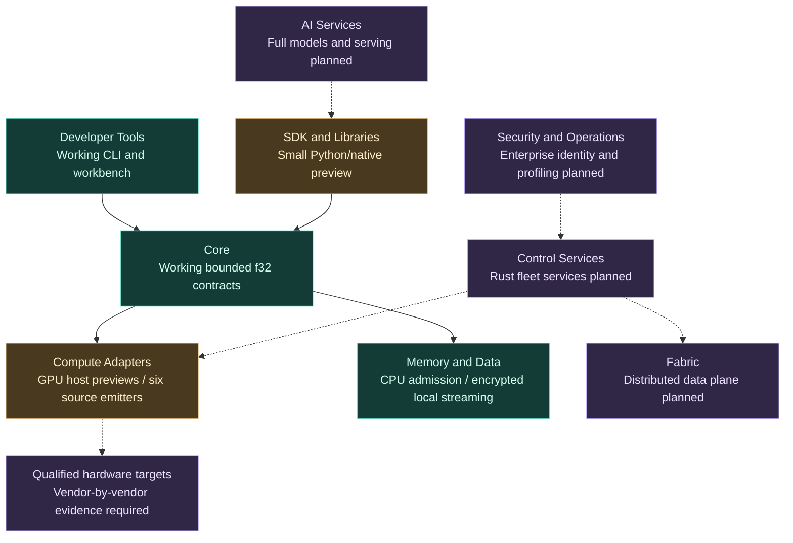

# HyperL software platform and architecture

Status as of 2026-10-08. HyperL is an independent open-source AI compute project.
Its architecture names describe software layers and deployment profiles, not new
silicon designs. This overview organizes the platform in a way that developers
and operators can scan, while keeping current code separate from future products.

## Platform at a glance

| Layer / module | Purpose and developer benefit | Current delivery |
| --- | --- | --- |
| **HyperL Core** | Versioned program/precision contracts and deterministic reference behavior | Working bounded `hyperl/1` f32 DAG: add, multiply, ReLU, ordered sum; JVM reference and native C ABI/static/shared preview |
| **HyperL Developer Tools** | Write, inspect, validate and fix supported local programs | Working CLI/workbench, JSON schema, examples, syntax highlighting, formatting, search, workspace IO, contextual diagnostics and reviewed fixes |
| **HyperL SDK and Libraries** | Easy Python authoring and gradual migration of existing code | Small Python/native C preview; NumPy/CPU PyTorch copies and three recipes work. Full SDK, text language, tensor/model import and zero-copy interop are planned |
| **HyperL Compute Adapters** | Execute through the API supported by each device | OpenCL/macOS Metal host previews; four bounded Metal cases pass on Radeon Pro 560X. Android Vulkan qualification runner passes 11 finite outputs/two overflow rejections on Adreno 506. Six source emitters; app GPU integration and CUDA/HIP/SYCL/NPU/FPGA dispatch remain planned |
| **HyperL Memory and Data** | Admission, bounded datasets and explicit ownership | Working CPU estimates/admission and authenticated encrypted local streaming. HBM/VRAM/NUMA/CXL accounting, direct IO and automatic encrypted SSD/NVMe spill are planned |
| **HyperL AI Services** | Inference, evaluation, serving, vision and reusable AI workflows | Only small preprocessing recipes today. Full model runtimes, training, autograd, serving APIs, model registry and provider connectors are planned |
| **HyperL Control Services** | Manage jobs, quotas, tenants, device fleets and emergency stops | Configuration bounds and authenticated read-only node observations exist. Rust control services, durable scheduling/leases and acknowledged fleet stop are planned |
| **HyperL Fabric** | Move work and data between qualified devices with measured latency | IPv6/IPv4/DNS endpoint configuration and explicit HTTPS node probe today. Collective communication, RDMA/InfiniBand/optical/vendor fabric adapters and network tuning are planned |
| **HyperL Security and Operations** | Protect data and expose reliable operational evidence | Local AES-256-GCM datasets, explicit keys/paths, bounded operations and local task cancellation work. Enterprise mTLS/OIDC/RBAC/audit, kernel/hardware auth providers and full profiling/telemetry are planned |

These labels group existing code and proposed interfaces; they are not nine
separately installable enterprise services. Meshlit's MCP/A2A/LLM gateway remains
a separate potential integration. HyperL starts no production gateway listener,
cluster scheduler, radio stack or privileged device-management service today.

## Foundational compute and acceleration stack

1. **Program and authoring:** bounded JSON IR now; standard Python API first, with
   a later Python-like text frontend. Preserve shared numerical/version semantics.
2. **Native engine:** portable C reference now; C/C++ optimized kernels/adapters
   and stable C ABI are the approved direction. SIMD/fusion/cache changes need
   correctness tests and benchmarks before claiming acceleration.
3. **Accelerators:** Metal for supported Apple-platform GPUs; CUDA for qualified
   NVIDIA targets; HIP/ROCm for supported AMD configurations; Intel oneAPI/SYCL/
   Level Zero; Vulkan/OpenCL where qualified; separate Ascend/mobile/FPGA providers.
4. **AI library adapters:** NumPy/CPU PyTorch copying preview now; later qualified
   ONNX Runtime, TensorRT, oneDNN/OpenVINO, ROCm libraries, MindSpore/CANN,
   PaddlePaddle, MNN, ncnn/TNN, JAX/TensorFlow, Apple and Microsoft paths.
5. **Profiling and memory:** current estimates and Metal host timing preview are
   small instruments, not a full device profiler. Plan traces for transfer, compile,
   queue, kernel, download, peak memory and end-to-end p50/p95/p99 timings.

CUDA compatibility has separate source, data, operator, graph, binary and runtime
boundaries. HyperL currently provides no universal CUDA ABI replacement, complete
tensor engine, Tensor Core lowering, MIG isolation or distributed collectives.

## Application development layer

- Workbench and CLI for local programming and actual CPU checks: **working**.
- Small reusable preprocessing recipes and Python embedding: **preview**.
- Full SDK/LSP/VS Code/JetBrains/debugger/profiler integration: **planned**.
- Model serving, evaluation, RAG/agent/vision pipelines and model registry: **planned**.
- MCP/A2A/provider gateway clients and policy integration with Meshlit or other
  reviewed gateways: **planned**, with explicit endpoints, credentials and schemas.

Security/vision/AI application goals do not turn f32 arithmetic into a cryptographic
primitive, model engine or autonomous-agent system. Use qualified providers through
versioned interfaces rather than reimplementing mature SDKs without evidence.

See the [AI Services design](AI_SERVICES_PLAN.md) for model/runtime packaging,
serving API, batching, profiles, registry and an ordered real-model pilot.

## Infrastructure management layer

Proposed Rust services: identity and enrollment; tenant quotas/admission; durable
jobs/leases; scheduler adapters; artifact/model registry; checkpoint/data service;
observability/audit; human/agent policies; acknowledged stop; rolling upgrades and
recovery. Reuse reviewed Kubernetes/Slurm/Ray/OpenTelemetry components where useful.

Human and agent control have separate credentials/scopes/limits. An emergency stop
must report acknowledged, completed and unreachable work separately. Killing a host
process does not prove an already-submitted physical GPU kernel has stopped. The
Metal preview blocks further work in its application process when completion is
unconfirmed; fleet isolation and recovery need the later control protocol.

## Deployment reference profiles

| HyperL profile | Intended use | Available now / later gate |
| --- | --- | --- |
| **Local Workstation** | One developer PC/Mac; offline tools and optional local GPU | CLI/GUI/native CPU work today; four Radeon Pro 560X Metal cases pass. Other exact GPUs and full models need qualification |
| **Mobile and Edge** | One phone/tablet or an opt-in edge worker; optional remote capacity | Listed Adreno 506 Vulkan kernels pass through a native test runner; app/JNI packaging, battery/thermal and lifecycle checks remain planned; desktop ZIP is not a phone installer |
| **Research Cluster** | Independent 3–5-host controlled pilot | Planned Rust control/worker services; durable work, security and stop/lease acceptance first |
| **Enterprise AI Cluster** | Multi-tenant datacenter inference/data/compute | Planned rollout to measured 16/64/256-worker trials; no current operating-capacity/SLA claim |
| **Large Fabric / Telecom Research** | Advanced interconnects, distributed workloads and telecom labs | Planned qualified transport/standards research; no RF activation or ISO/3GPP certification claim |

Profile limits (up to one million inventory entries and 256 active workers) are
configuration bounds, not demonstrated cluster scale. HBM capacity, link width,
NVLink/RDMA/optical topology and homogeneous turbo scheduling must be observed and
measured on real devices before becoming available execution capabilities.

## Current support counts

- **Two CPU implementations:** Kotlin/JVM reference and native C reference preview.
- **Six source emitters:** C99/CPU, CUDA, HIP, OpenCL C, Metal MSL and Vulkan GLSL.
- **Two GPU host bridges:** OpenCL and macOS Metal preview. **One exact GPU has
  desktop workload evidence:** Radeon Pro 560X passes four bounded Metal cases and
  one expected rejection. [Hardware record](A1990_METAL_VALIDATION.md).
- **One Android Vulkan qualification runner:** Adreno 506 passes eleven finite
  outputs/two expected rejections on the owner's Galaxy A20s. This is not
  Meshlit app GPU wiring, general OEM support or model inference.
  [Android hardware/build record](ANDROID_VULKAN.md).
- **Two framework copying bridges:** actual NumPy and CPU PyTorch paths; the latter
  is checked by Linux CI. Optional PyTorch CUDA dispatch exists but is unrun.
- **Zero NVIDIA architecture families qualified**, and no complete NVIDIA
  enterprise software integration yet. [Detailed NVIDIA matrix](NVIDIA_COMPATIBILITY.md).

This counts implementations/interfaces, not all OS/device combinations, model
frameworks or supported SKUs. [Validation](VALIDATION.md) is authoritative evidence.

## Why GitHub shows mostly Kotlin

The current CLI/workbench, validator and original CPU reference contain most of
the source bytes, including their tests. Native C and the new Objective-C++ Metal
host are smaller, and Rust fleet services are not implemented yet. GitHub's
[Linguist statistics](https://github.com/github-linguist/linguist/blob/main/docs/how-linguist-works.md)
count eligible source bytes, not runtime compute time or performance. Language
share changes as real native implementations grow; no statistics masking is needed.

Further reading: [native architecture](NATIVE_PERFORMANCE_ARCHITECTURE.md),
[library interop](LIBRARY_INTEROPERABILITY.md), [enterprise services](ENTERPRISE_AND_CLUSTER_PLAN.md),
[mobile](MOBILE_AND_EDGE_PLAN.md), [AMD ecosystem](AMD_COMPATIBILITY.md), [AMD Mac/Metal](MACOS_METAL.md),
[memory](MEMORY.md), [telecom research](TELECOM.md).
